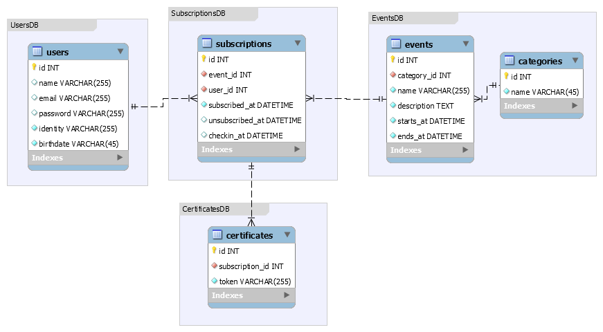

# SA Services
This is a microservices approach for the **final task** of the Software Architecture class of the Bachelor of Software Engineering at UNIVATES.


## Task description

Based on the concepts of microservices, we will carry out an implementation based on the following theme.

**Theme: Event System**

Imagine a small system for managing events. Users can access the portal, search for available events and register. After registration, the user is allowed to consult his registration and also cancel, as long as within the acceptable period for cancellation.

When attending the event, attendants perform the participants' checkin. A non-registered participant can check in by means of a basic and quick registration at the event's reception desk. The complete data of that user must be filled in later by him in the system itself.

After the end of the event, users are allowed to issue their certificate of participation. For this, an interface is provided to the user where all the events that he participated are listed,

allowing selection of certificate generation. Still on the certificates, they have a unique authentication code printed on the document itself, accompanied by an address for digital validation of that certificate.

The system sends e-mail to each activity that changes data in the enrollment system, whether they are: enrollment, cancellation, attendance and certificate issuance.


## Architecture


## Database Model



## Containers

#### `sa-webserver`
NGINX web server, running on `localhost:80` and `172.10.10.254:80`. 

It is the entrypoint for the application. NGINX acts as an API gateway and reverse proxy for all the microservices.


#### `sa-client`
Angular application, running on `localhost:8000` and `172.10.10.5:80`.

It is the frontend application that consumes all these microservices.


#### `sa-authentication`
GoLang application, running on `localhost:8010` and `172.10.10.10:80`.

It handles the authentication of the users with email and password.


#### `sa-users`
PHP Lumen application, running on `localhost:8020` and `172.10.10.20:80`.

It handles the actions related to users resources.


#### `sa-users-db`
MariaDB, running on `localhost:8021` and `172.10.10.21:3306`.

It is keeps all the data related to users. 


#### `sa-events`
PHP Laravel application, running on `localhost:8030` and `172.10.10.30:80`.

It handles the actions related to events resources.


#### `sa-events-db`
PostgreSQL, running on `localhost:8031` and `172.10.10.31:5432`.

It is keeps all the data related to events. 


#### `sa-subscriptions`
Node Express application, running on `localhost:8040` and `172.10.10.40:80`.

It handles the actions related to subscriptions resources.


#### `sa-subscriptions-db`
MongoDB, running on `localhost:8041` and `172.10.10.41:27017`.

It is keeps all the data related to subscriptions. 


#### `sa-checkin`
Python Flask application, running on `localhost:8042` and `172.10.10.42:80`.

It handles the actions related to checkin resources.


## Running
On the root folder, run:
```
docker-compose up --build -d
```
  
