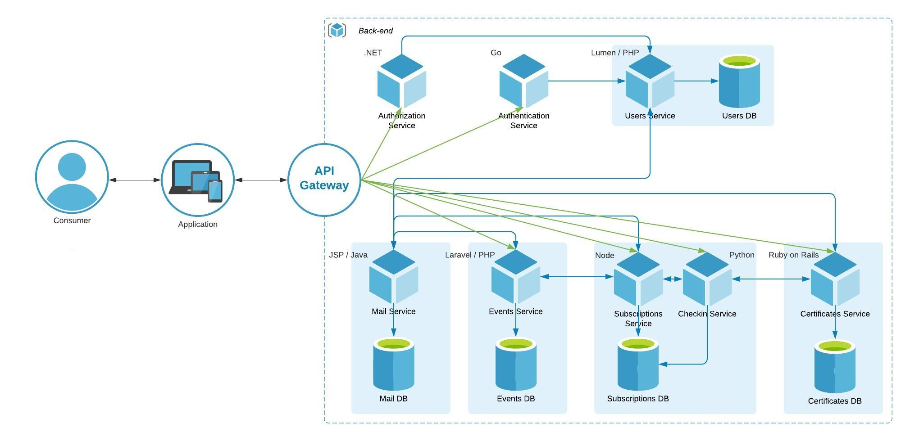

# SA Services
This is a microservices approach for the Software Architecture class of the Bachelor of Software Engineering at UNIVATES.

### Architecture


### Database Model


## Containers

### `sa-client`
Angular application, running on `172.10.10.5:8000`.

##### Endpoints
| Route            |
| ---------------- |
| `/login`         |
| `/logout`        |
| `/register`      |
| `/events`        |
| `/subscriptions` |
| `/checkin`       |
| `/checkin/:id`   |


### `sa-authentication`
GoLang application, running on `172.10.10.10:8010`.

##### Endpoints
| Route    | Method | Params                                                | Success                                             | Failure                       |
| -------- | ------ | ----------------------------------------------------- | --------------------------------------------------- | ----------------------------- |
| `/login` | `POST` | ```{"email": "foo@bar.com", "password": "asecret"}``` | ```{"token": "thatlongtoken", "expires": "time"}``` | ```{"error": "A message."}``` |


### `sa-users`
PHP Lumen application, running on `172.10.10.20:8020`.

##### Endpoints
| Route                | Method | Params                                                                                                                          | Success                       | Failure                       |
| -------------------- | ------ | ------------------------------------------------------------------------------------------------------------------------------- | ----------------------------- | ----------------------------- |
| `/users/attempt`     | `POST` | ```{"email": "foo@bar.com", "password": "asecret"}```                                                                           | ```{"user": {...}}```         | ```{"error": "A message."}``` |
| `/users/{id}/exists` | `GET`  |                                                                                                                                 | ```{"exists": true\|false}``` | ```{"error": "A message."}``` |
| `/users/store`       | `POST` | ```{"name": "John Doe", "birthdate": "1990-01-01", "identity": "01234567890", "email": "foo@bar.com", "password": "johndoe"}``` | ```{"user": {...}}```         | ```{"error": "A message."}``` |
| `/users/fetch`       | `GET`  |                                                                                                                                 | ```{"users": {...}}```        | ```{"error": "A message."}``` |


### `sa-users-db`
MariaDB, running on `172.10.10.21:8021`.


### `sa-events`
PHP Laravel application, running on `172.10.10.30:8030`.

##### Endpoints
| Route                 | Method | Params | Success                       | Failure                       |
| --------------------- | ------ | ------ | ----------------------------- | ----------------------------- |
| `/events/index`       | `GET`  |        | ```{"events": {...}}```       | ```{"error": "A message."}``` |
| `/events/{id}/exists` | `GET`  |        | ```{"exists": true\|false}``` | ```{"error": "A message."}``` |
| `/events/fetch`       | `GET`  |        | ```{"events": {...}}```       | ```{"error": "A message."}``` |


### `sa-events-db`
PostgreSQL, running on `172.10.10.31:8031`.


### `sa-subscriptions`
Node Express application, running on `172.10.10.40:8040`.

##### Endpoints
| Route                   | Method | Params                                                                                                                          | Success                       | Failure                       |
| ----------------------- | ------ | --------------------------------------- | ----------------------- | ----------------------------- |
| `/subscriptions/list`   | `GET`  |                                         | ```{"users": {...}}```  | ```{"error": "A message."}``` |
| `/subscriptions/create` | `POST` | ```{"event_id": "1", "user_id": "1"}``` | ```{"success": true}``` | ```{"error": "A message."}``` |
| `/subscriptions/delete` | `POST` | ```{"event_id": "1", "user_id": "1"}``` | ```{"success": true}``` | ```{"error": "A message."}``` |


### `sa-subscriptions-db`
MongoDB, running on `172.10.10.41:8041`.


### `sa-checkin`
Python Flask application, running on `172.10.10.42:8042`.

##### Endpoints
| Route      | Method | Params                                                                        | Success                 | Failure                       |
| ---------- | ------ | ----------------------------------------------------------------------------- | ----------------------- | ----------------------------- |
| `/checkin` | `POST` | ```{"user_id": "1", "event_id": "1"}```                                       | ```{"success": true}``` | ```{"error": "A message."}``` |
| `/checkin` | `POST` | ```{"event_id": "1", "identity": "00000000000", "birthdate": "0000-00-00"}``` | ```{"success": true}``` | ```{"error": "A message."}``` |

  
## Building
On the `bewize-infra` folder, run:
```
docker-compose up --build -d
```
  
